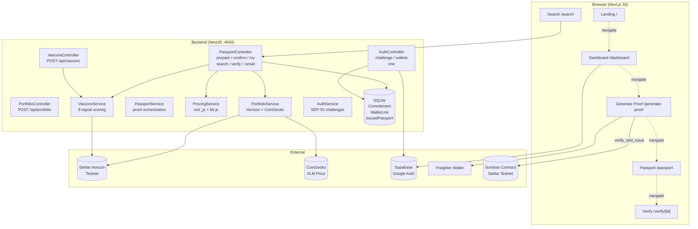
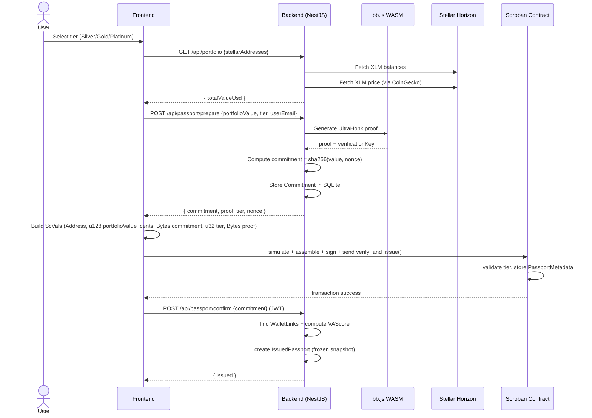
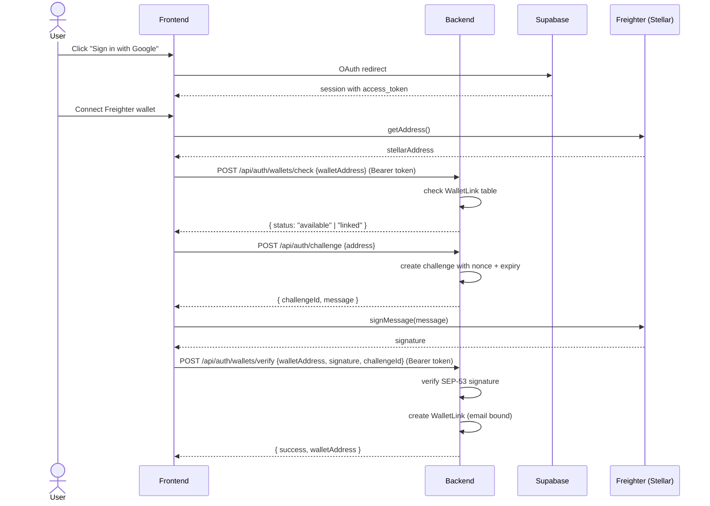
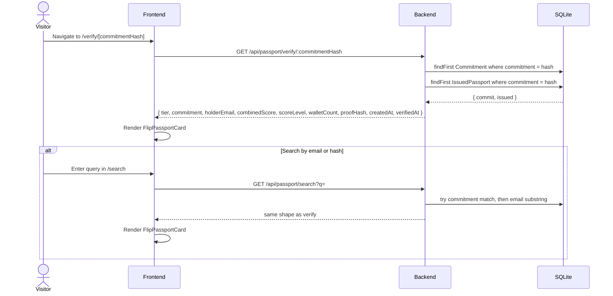
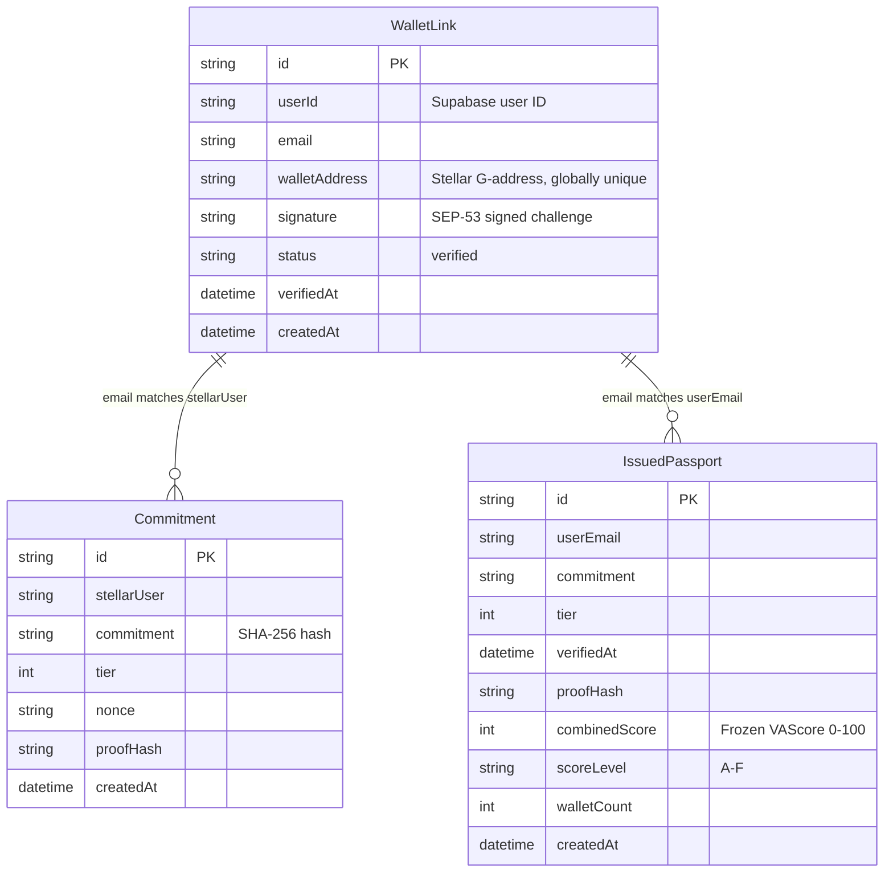

# Crypto Credit Passport

> Prove your crypto portfolio value and onchain activity history on Stellar — without revealing your wallet addresses.

A zero-knowledge credit scoring system built on **Stellar + Soroban + Noir**. Users generate UltraHonk ZK proofs that their portfolio exceeds a threshold, mint a passport on Stellar testnet, and get a verifiable credential backed by a privacy-preserving VAScore (0–100, displayed A–F).

## Architecture



## Flows

### Proof Generation & Passport Issuance



### Wallet Binding Flow



### Passport Verification & Search



## Directory Tree

```
stellar-hack/
├── circuits/credit_passport/       # Noir ZK circuit (private portfolio >= public threshold)
│   ├── src/main.nr                 # Circuit constraint (3 lines)
│   ├── Nargo.toml                  # Package manifest
│   ├── Prover.toml                 # Example inputs for local execution
│   └── target/credit_passport.json # Compiled ACIR bytecode (~50KB, loaded by backend at runtime)
├── contracts/credit-passport/      # Soroban smart contract
│   ├── src/lib.rs                  # verify_and_issue, get_passport, has_passport, verify_proof
│   ├── Cargo.toml                  # soroban-sdk 27.0.0-rc.1
│   └── test_snapshots/             # Snapshot-based tests
├── backend/                        # NestJS API — proof generation, portfolio aggregation, auth, scoring
│   ├── src/
│   │   ├── passport/               # controller + service (prepare, confirm, my, search, verify)
│   │   ├── portfolio/              # Stellar Horizon balance aggregation + CoinGecko price
│   │   ├── proving/                # bb.js + noir_js WASM prover wrapper
│   │   ├── vascore/                # 8-signal credit scoring (controller + service + types)
│   │   ├── auth/                   # Supabase JWT guard + wallet challenge/verify controller/service
│   │   ├── prisma/                 # Global module + service (Prisma 7 + libSQL adapter)
│   │   ├── lib/supabase-admin.ts   # Lazy Supabase admin client
│   │   ├── app.module.ts           # Root module
│   │   └── main.ts                 # Bootstrap (port 4000)
│   └── prisma/
│       ├── schema.prisma           # 3 models: Commitment, WalletLink, IssuedPassport
│       └── dev.db                  # SQLite database
├── frontend/                       # Next.js 16 dApp — 6 routes, 14 components
│   ├── src/
│   │   ├── app/
│   │   │   ├── page.tsx                    # Landing page (hero, how-it-works, CTA)
│   │   │   ├── layout.tsx                  # Root layout (Manrope + Inter fonts, providers)
│   │   │   ├── providers.tsx               # Theme + StellarWallet + Auth providers
│   │   │   ├── globals.css                 # CSS variables (light/dark), Tailwind v4 directives
│   │   │   ├── middleware.ts               # Supabase SSR session refresh
│   │   │   ├── auth/callback/route.ts      # Supabase OAuth code exchange
│   │   │   ├── dashboard/page.tsx          # Wallet management + passport status + VAScore
│   │   │   ├── generate-proof/page.tsx     # Tier selection → portfolio → proof → Stellar submission
│   │   │   ├── passport/page.tsx           # Credential card display + PDF download
│   │   │   ├── search/page.tsx             # Public search by email or commitment hash
│   │   │   └── verify/[id]/page.tsx        # Public verification page
│   │   ├── components/
│   │   │   ├── FlipPassportCard.tsx        # 3D-tilt flip card (shared by hero, verify, search)
│   │   │   ├── HeroPassportCard.tsx        # Demo Gold-tier flip card for landing page
│   │   │   ├── passport-card.tsx           # Full passport card (desktop horizontal + mobile vertical)
│   │   │   ├── InteractivePassportCard.tsx  # Legacy tilt card
│   │   │   ├── PassportSeal.tsx            # SVG "ZK VERIFIED" shield seal
│   │   │   ├── QRDisplay.tsx               # QR code from url using qrcode library
│   │   │   ├── WalletManager.tsx           # Linked wallets table + tiers + scores + connect UI
│   │   │   ├── StellarWalletButton.tsx     # Freighter connect/disconnect
│   │   │   ├── GoogleSignInButton.tsx      # Supabase Google OAuth button
│   │   │   ├── Header.tsx                  # Sticky header (logo, wallet, auth, theme toggle)
│   │   │   ├── AmbientBackground.tsx       # Animated gradient orbs (light/dark aware)
│   │   │   ├── ThemeToggle.tsx             # Light/dark mode switch
│   │   │   ├── ComparisonIllustration.tsx   # Traditional vs Crypto credit signals side-by-side
│   │   │   └── LenderViewComparison.tsx    # What lender sees vs what stays private
│   │   └── lib/
│   │       ├── api.ts                      # 13 API client functions
│   │       ├── stellar-wallet-context.tsx   # Freighter wallet React context (+ signTransaction)
│   │       ├── theme-context.tsx           # Theme state + localStorage persistence
│   │       ├── use-auth.ts                 # Supabase auth hook (user, session, signIn, signOut)
│   │       └── supabase/
│   │           ├── client.ts               # Lazy browser Supabase client singleton
│   │           └── server.ts               # SSR Supabase client for middleware
│   ├── public/
│   │   ├── Credence.png                    # App logo
│   │   └── Icon.png                        # Favicon
│   ├── next.config.ts                      # Google profile images remote pattern
│   └── package.json                        # next@16, freighter-api, stellar-sdk, supabase-ssr, etc.
├── README.md                               # This file
```

## First-time Setup

```bash
# 1. Install tooling
noirup -v 1.0.0-beta.22
rustup target add wasm32v1-none

# 2. Compile the ZK circuit
cd circuits/credit_passport && nargo compile && cd ../..

# 3. Build Soroban contract
cd contracts/credit-passport
cargo build --release --target wasm32v1-none
cd ../..

# 4. Backend — install deps + create database
cd backend
cp .env.example .env   # edit with your values
npm install
npx prisma db push
npx prisma generate
cd ..

# 5. Frontend — install deps
cd frontend
cp .env.local.example .env.local   # edit with your values
npm install
cd ..
```

## Running

```bash
# Terminal 1 — Backend (port 4000)
cd backend
npm run build && npm run start:prod

# Terminal 2 — Frontend (port 3000)
cd frontend && npm run dev
```

Verify:

```bash
curl http://localhost:4000/api/portfolio -X POST \
  -H 'Content-Type: application/json' \
  -d '{"stellarAddresses":["GDQNY..."]}'
# → {"totalValueUsd":...}

curl http://localhost:3000
# → HTML page
```

## Stopping

```bash
kill $(lsof -ti :4000)   # stop backend
kill $(lsof -ti :3000)   # stop frontend
```

## Prerequisites

| Tool | Required Version | Install |
|------|----------------|---------|
| Noir | 1.0.0-beta.22 | `noirup -v 1.0.0-beta.22` |
| Rust | 1.85+ | `rustup target add wasm32v1-none` |
| Node.js | 24.x | via nvm |
| npm pkg | @aztec/bb.js@6.0.0-nightly.20260605 | auto-installed via backend |
| npm pkg | @noir-lang/noir_js@1.0.0-beta.22 | auto-installed via backend |
| stellar-cli | 27.0.0 | via install script |

## Deployed Contract

| Network | Contract ID |
|---------|-------------|
| Stellar Testnet | `CBIYSGXEVABVVUGPSXIZOGFSVLAVDB6S6PDLW6RSK35BHECQGXKLCD42` |

[Explorer Link](https://stellar.expert/explorer/testnet/contract/CBIYSGXEVABVVUGPSXIZOGFSVLAVDB6S6PDLW6RSK35BHECQGXKLCD42)

## Tier Thresholds

All portfolio values are scaled to **cents** (multiplied by 100) before entering the circuit and contract.

| Tier | Portfolio Threshold | Circuit/Contract Threshold (cents) |
|------|-------------------|------------------------------------|
| 1 — Silver | >= $1,000 | 100000 |
| 2 — Gold | >= $5,000 | 500000 |
| 3 — Platinum | >= $25,000 | 2500000 |

## VAScore Formula

The VAScore is computed off-chain from Stellar Horizon data. Eight signals weighted and normalized 0–100:

| Signal | Weight | Source |
|--------|--------|--------|
| Portfolio Value (XLM + USDC) | 30% | Horizon account balances |
| Account Age | 15% | Account creation timestamp |
| Transaction Frequency (per month) | 15% | Payment operations / months active |
| Failed Transaction Ratio (inverted) | 10% | Failed operations / total |
| Average Payment Volume | 10% | Total sent / total payments |
| Incoming/Outgoing Ratio | 5% | Payments received / payments sent |
| Trustline Count | 5% | Number of trustlines (capped at 20) |
| Consistency (months with activity) | 10% | Unique months with ≥1 payment |

Level mapping: **A** (80–100), **B** (65–79), **C** (50–64), **D** (35–49), **E** (20–34), **F** (0–19).

Multi-wallet combination: max age, summed portfolio, pooled transaction counts across all verified wallets.

## Data Model



## Notes

- **bb.js 6.0.0-nightly** is the ONLY version that can parse Noir 1.0.0-beta.22 ACIR. bb CLI 4.3.1/4.4.0-nightly and bb.js ≤0.56.0 all fail with ACIR format mismatch.
- **Proof generation** is single-threaded WASM — ~13s cold, ~1s warm. Acceptable for hackathon demo.
- **Soroban contract** uses SHA-256 proof hash verification as placeholder (real UltraHonk verifier not yet available on crates.io).
- **`user.require_auth()`** means the caller signs the transaction — no admin key needed for issuance.
- **Passport is a frozen snapshot** — the combined score and wallet count are captured at issuance time (`confirmPassport`) and stored in `IssuedPassport`. They do not update when new wallets are linked later.
- **Portfolio values** are multiplied by 100 (cents) for the circuit and contract to avoid floating-point issues.
- **Supabase Auth**: Google OAuth only. Wallet binding is Stellar-only (EVM removed). Wallets are permanently bound to one email via `WalletLink` table.
- **Route ordering matters**: `GET /api/passport/my` and `GET /api/passport/search` are declared before `GET /api/passport/:userEmail` to avoid `my` / `search` being matched as a userEmail parameter.
- **Horizon endpoint**: `https://horizon-testnet.stellar.org`; CoinGecko cache TTL: 60s; fallback XLM price: $0.10.

## API Endpoint Summary

### Portfolio

| Method | Route | Auth | Description |
|--------|-------|------|-------------|
| POST | `/api/portfolio` | None | Aggregate Stellar portfolio (XLM at market price + USDC) |

### Passport

| Method | Route | Auth | Description |
|--------|-------|------|-------------|
| POST | `/api/passport/prepare` | None | Generate ZK proof + store commitment |
| GET | `/api/passport/my` | Bearer JWT | Current user's frozen IssuedPassport |
| POST | `/api/passport/confirm` | Bearer JWT | Freeze snapshot after on-chain issuance |
| GET | `/api/passport/search?q=` | None | Search by email (substring) or commitment hash (exact) |
| GET | `/api/passport/verify/:commitmentHash` | None | Verify passport by commitment hash |
| GET | `/api/passport/:userEmail` | None | Old-style lookup by email (minimal fields) |

### Auth / Wallets

| Method | Route | Auth | Description |
|--------|-------|------|-------------|
| GET | `/api/auth/me` | Bearer JWT | Current user from Supabase |
| POST | `/api/auth/challenge` | None | Create Stellar SEP-53 signing challenge |
| POST | `/api/auth/wallets/check` | Bearer JWT | Check if a wallet address is already linked |
| POST | `/api/auth/wallets/verify` | Bearer JWT | Verify wallet ownership via signature |
| GET | `/api/auth/wallets` | Bearer JWT | List all linked wallets for current user |

### VAScore

| Method | Route | Auth | Description |
|--------|-------|------|-------------|
| POST | `/api/vascore` | None | Compute score for given Stellar addresses |

## Frontend Component Tree

```
providers.tsx
├── ThemeProvider (theme-context.tsx)
│   └── localStorage persistence
├── StellarWalletProvider (stellar-wallet-context.tsx)
│   └── Freighter connect/disconnect/signMessage/signTransaction
└── layout.tsx
    ├── Header.tsx
    │   ├── Logo (Credence.png)
    │   ├── StellarWalletButton.tsx
    │   ├── GoogleSignInButton.tsx
    │   └── ThemeToggle.tsx
    ├── Landing (page.tsx)
    │   ├── AmbientBackground.tsx
    │   ├── HeroPassportCard.tsx (FlipPassportCard with demo data)
    │   ├── ComparisonIllustration.tsx
    │   └── LenderViewComparison.tsx
    ├── Dashboard (/dashboard)
    │   ├── AmbientBackground.tsx
    │   ├── WalletManager.tsx (wallet table, tiers, scores, verify flow)
    │   ├── PassportCard (passport-card.tsx)
    │   └── GoogleSignInButton.tsx
    ├── Generate Proof (/generate-proof)
    │   ├── AmbientBackground.tsx
    │   └── Tier selection + step progress + Stellar submission
    ├── Passport (/passport)
    │   ├── PassportCard (passport-card.tsx)
    │   ├── PassportSeal.tsx
    │   ├── QRDisplay.tsx
    │   └── PDF export (html-to-image + jsPDF)
    ├── Search (/search)
    │   ├── Search input
    │   └── FlipPassportCard.tsx
    └── Verify (/verify/[id])
        └── FlipPassportCard.tsx
```

## License

MIT
