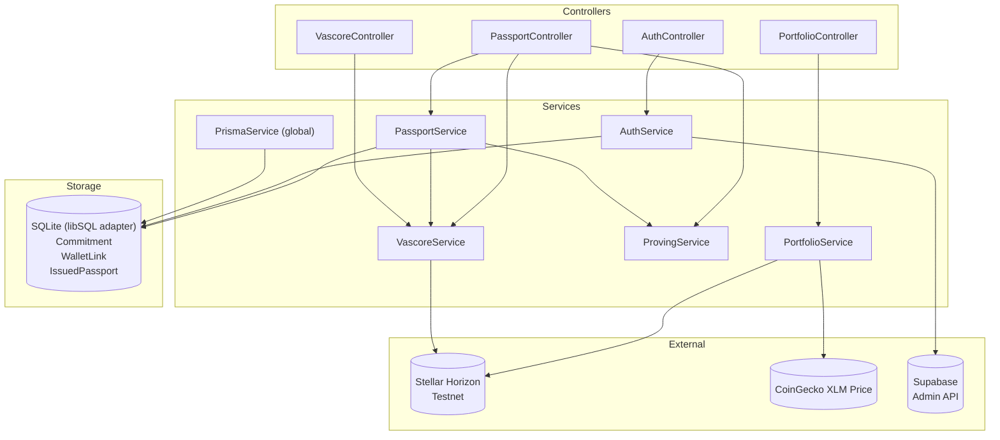
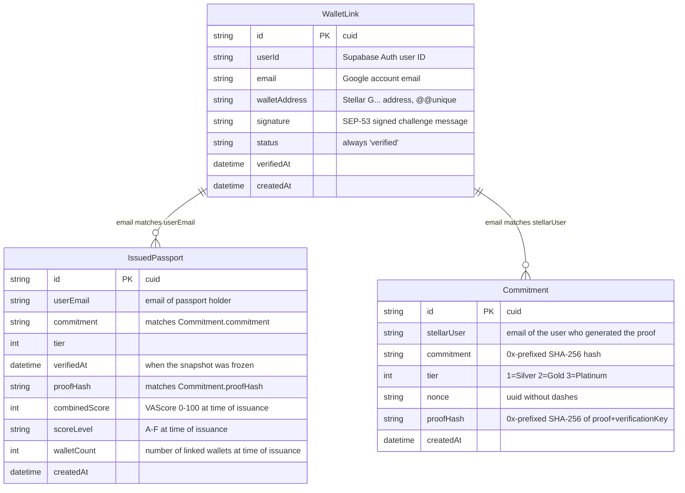
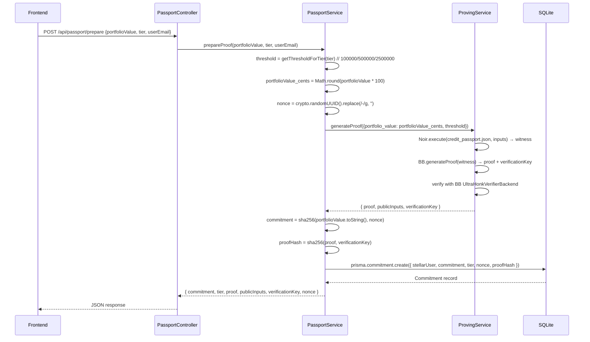
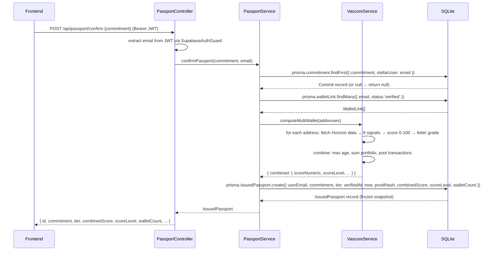
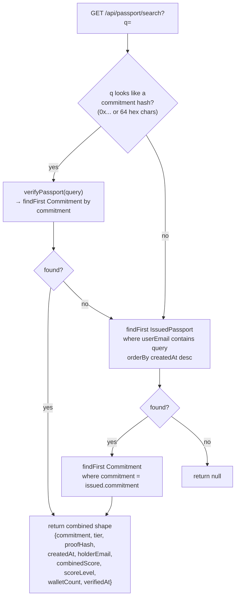
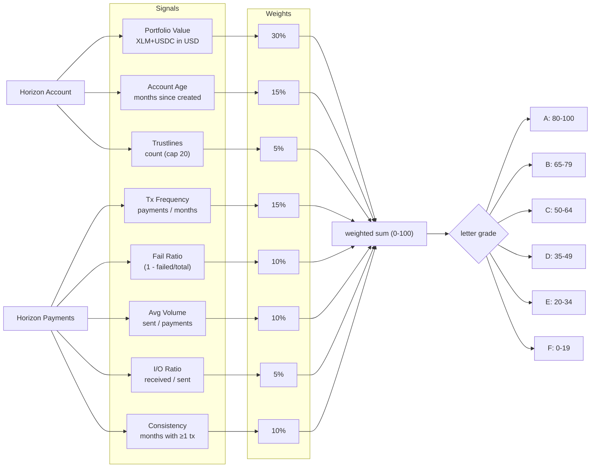

# Backend — NestJS API (Proving Engine + Auth + Scoring)

Aggregate Stellar portfolios via Horizon, generate UltraHonk ZK proofs via bb.js WASM, manage passport commitments, compute VAScores, and handle wallet binding via Supabase JWT auth.

## Architecture



## Module Dependency Graph

```mermaid
graph LR
  AppModule --> PassportModule
  AppModule --> PortfolioModule
  AppModule --> AuthModule
  AppModule --> VascoreModule
  AppModule --> PrismaModule[PrismaModule (Global)]
  AppModule --> ProvingModule[ProvingModule (Global)]

  PassportModule --> VascoreModule
  PassportModule --> PrismaModule
  PassportModule --> ProvingModule

  PortfolioModule --> PrismaModule

  AuthModule --> PrismaModule

  VascoreModule --> PrismaModule
```

## Modules

| Module | Exported | Description |
|--------|----------|-------------|
| **PrismaModule** | PrismaService (Global) | SQLite via Prisma 7 + `@prisma/adapter-libsql`. All services inject PrismaService. |
| **ProvingModule** | ProvingService (Global) | Wraps `@noir-lang/noir_js` witness generation + `@aztec/bb.js` UltraHonk proof generation. Loads `credit_passport.json` on init. |
| **PassportModule** | PassportService | Orchestrates proof generation, DB storage, VAScore computation, snapshot confirmation, search, and on-chain reads. |
| **PortfolioModule** | PortfolioService | Fetches XLM/USDC balances from Horizon, prices XLM via CoinGecko, aggregates across multiple Stellar addresses. |
| **AuthModule** | SupabaseAuthGuard | Supabase JWT verification guard + wallet challenge/verify using Stellar SEP-53 signatures. |
| **VascoreModule** | VascoreService | 8-signal credit scoring algorithm from Horizon account data. |

## Data Model



## API Endpoints

### Portfolio

| Method | Route | Auth | Request Body | Response |
|--------|-------|------|-------------|----------|
| POST | `/api/portfolio` | None | `{ "stellarAddresses": ["G..."] }` | `{ "totalValueUsd": number }` |

Logic: For each address, fetches the account from Horizon, sums native XLM balance (priced via CoinGecko, 60s cache) + USDC trustline balance.

### Passport

| Method | Route | Auth | Request Body / Param | Response |
|--------|-------|------|---------------------|----------|
| POST | `/api/passport/prepare` | None | `{ "portfolioValue": number, "tier": number, "userEmail": string }` | `{ commitment, tier, proof, publicInputs, verificationKey, nonce }` |
| GET | `/api/passport/my` | Bearer JWT | — | `{ commitment, tier, verifiedAt, proofHash, walletCount, combinedScore: { scoreNumeric, scoreLevel }, userEmail }` |
| POST | `/api/passport/confirm` | Bearer JWT | `{ "commitment": string }` | `{ id, userEmail, commitment, tier, combinedScore, scoreLevel, walletCount, ... }` |
| GET | `/api/passport/search?q=` | None | query param `q` | Same shape as verify endpoint |
| GET | `/api/passport/verify/:commitmentHash` | None | path param | `{ commitment, tier, proofHash, createdAt, holderEmail, combinedScore, scoreLevel, walletCount, verifiedAt }` |
| GET | `/api/passport/:userEmail` | None | path param | `{ commitment, tier, createdAt }` (minimal) |

### Auth / Wallets

| Method | Route | Auth | Request Body | Response |
|--------|-------|------|-------------|----------|
| GET | `/api/auth/me` | Bearer JWT | — | User object from Supabase |
| POST | `/api/auth/challenge` | None | `{ "address": "G..." }` | `{ challengeId, message }` |
| POST | `/api/auth/wallets/check` | Bearer JWT | `{ "walletAddress": "G..." }` | `{ status: "available" | "linked" | "belongs_to_other" }` |
| POST | `/api/auth/wallets/verify` | Bearer JWT | `{ "walletAddress", "signature", "challengeId" }` | `{ id, walletAddress, email, status }` |
| GET | `/api/auth/wallets` | Bearer JWT | — | `[{ id, walletAddress, status, verifiedAt, email }]` |

### VAScore

| Method | Route | Auth | Request Body | Response |
|--------|-------|------|-------------|----------|
| POST | `/api/vascore` | None | `{ "stellarAddresses": ["G..."] }` | `{ wallets: WalletScoreData[], combined: CombinedScore }` |

## Flows

### Prepare Proof — Detailed



### Confirm Passport — Detailed



### Search — Detailed



## VAScore Algorithm



Multi-wallet combination: takes the maximum account age across all wallets, sums portfolio values, pools all transactions for frequency/volume/consistency, then scores the pooled data as if it were a single wallet.

## Key Implementation Details

- **Prisma 7 driver adapter**: Uses `@prisma/adapter-libsql` instead of the legacy datasource URL. The `prisma.config.js` file provides the database URL for CLI commands (`db push`, `generate`).
- **Lazy Supabase admin**: `lib/supabase-admin.ts` defers `createClient()` until first call because `SUPABASE_SERVICE_ROLE_KEY` isn't available at module load time (NestJS `ConfigModule` loads during bootstrap).
- **SupabaseAuthGuard**: Gets the Supabase admin client inside `canActivate()` (not at module level) for the same reason. Extracts `req.user.email` from the JWT payload.
- **Route ordering in PassportController**: `search`, `my`, and `verify/:commitmentHash` are declared before `:userEmail` to avoid path parameter matching.
- **Stellar SEP-53 signing**: Wallet verification uses `StellarSdk.StrKey` helpers. The challenge message includes a nonce and expiry. Signature is verified with `verifyMessageSignature`.
- **bb.js initialization**: The ProvingService loads `credit_passport.json` from the filesystem on `onModuleInit`, creates a single `Noir` instance + `UltraHonkBackend` instance, and reuses them across all proof requests.

## Environment Variables

| Variable | Default | Description |
|----------|---------|-------------|
| `PORT` | `4000` | Server port |
| `DATABASE_URL` | `file:./prisma/dev.db` | SQLite database path |
| `STELLAR_RPC_URL` | `https://soroban-testnet.stellar.org` | Stellar RPC for contract simulation |
| `STELLAR_HORIZON_URL` | `https://horizon-testnet.stellar.org` | Horizon for balance/tx data |
| `CONTRACT_ID` | — | Deployed Soroban contract address |
| `ADMIN_SECRET_KEY` | — | Stellar admin secret key (for contract deploy) |
| `SUPABASE_URL` | — | Supabase project URL |
| `SUPABASE_SERVICE_ROLE_KEY` | — | Supabase admin key (for JWT verification + user lookup) |

## Setup

```bash
npm install
cp .env.example .env   # edit variables
npx prisma db push     # create SQLite database
npx prisma generate    # generate Prisma client
npm run build
npm run start:prod     # or: npm run start:dev
```

## Dependencies

| Package | Version | Purpose |
|---------|---------|---------|
| @aztec/bb.js | 6.0.0-nightly.20260605 | WASM UltraHonk prover (proof + verify) |
| @noir-lang/noir_js | 1.0.0-beta.22 | Circuit witness generation from ACIR bytecode |
| @nestjs/* | 11.x | Framework (core, common, config, platform-express) |
| @prisma/client | 7.8.0 | ORM |
| @prisma/adapter-libsql | latest | SQLite driver adapter for Prisma 7 |
| @stellar/stellar-sdk | 16.0.1 | Contract simulation reads, ScVal parsing |
| @supabase/supabase-js | 2.108.2 | Admin client for JWT verification |
