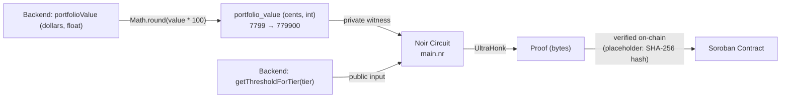
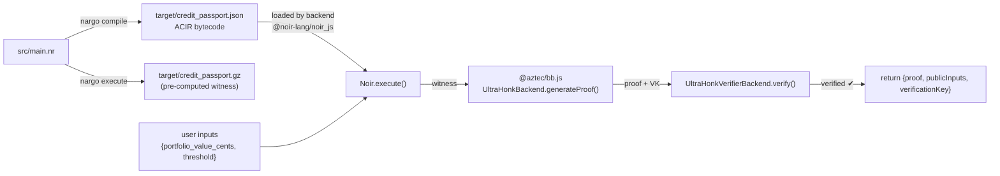

# Credit Passport — Noir Circuit

Zero-knowledge circuit that proves a user's portfolio value meets or exceeds a tier threshold without revealing the exact value.

## Constraint

```noir
fn main(portfolio_value: Field, threshold: pub Field) {
    assert(!portfolio_value.lt(threshold));
}
```

- `portfolio_value` — **private** witness (hidden from the verifier)
- `threshold` — **public** input (visible on-chain, emitted as a public input)
- Proves `portfolio_value >= threshold` using Noir's native field arithmetic
- The single constraint compiles to ~3 ACIR opcodes, producing a ~50KB ACIR bytecode file

## Threshold Mapping

Portfolio values are scaled to **cents** (multiplied by 100) before entering the circuit. The backend rounds `portfolioValue * 100` to an integer before passing it as the circuit input.

| Tier | Dollar Threshold | Circuit Input (cents) | Circuit Public Output |
|------|-----------------|----------------------|----------------------|
| 1 — Silver | $1,000 | 100000 | threshold = 100000 |
| 2 — Gold | $5,000 | 500000 | threshold = 500000 |
| 3 — Platinum | $25,000 | 2500000 | threshold = 2500000 |

## Data Flow



## Files

| File / Dir | Purpose |
|------------|---------|
| `src/main.nr` | Circuit definition (3 lines: `portfolio_value >= threshold`) |
| `Nargo.toml` | Package manifest (`type = "bin"`, no dependencies) |
| `Prover.toml` | Example inputs for `nargo execute` |
| `Verifier.toml` | Expected public inputs for verification |
| `target/credit_passport.json` | **Compiled ACIR bytecode + ABI** (~50KB). The backend loads this at runtime via `@noir-lang/noir_js` to reconstruct the circuit and generate witnesses. **This is the essential production artifact.** |
| `target/credit_passport.gz` | Pre-computed witness from `nargo execute` using `Prover.toml`. Not used in production — the backend generates witnesses dynamically from real user inputs. |
| `target/proof/` | **Empty.** Would contain `nargo prove` output, but bb CLI 4.x is incompatible with this ACIR format (see compatibility note below). |
| `target/vk/` | **Empty.** Would contain verification key from `nargo prove`. The backend generates the VK itself via bb.js WASM (`UltraHonkBackend.generateProof` returns VK). |
| `target/vk_chonk/` | **Empty.** Legacy Honk verification key directory. Unused. |
| `build.sh` | Shell script: `nargo compile && nargo execute && nargo info` |

The backend only needs `target/credit_passport.json`. The `proof/` and `vk/` subdirectories are empty because `nargo prove` calls the bb CLI binary under the hood, which crashes on Noir 1.0.0-beta.22 ACIR. Instead, all proving and verification happens inside the Node.js process via `@aztec/bb.js` WASM, bypassing the bb CLI entirely.

## Build Process



## Commands

```bash
# Compile to ACIR bytecode
nargo compile

# Generate witness from Prover.toml
nargo execute

# Gate count / circuit info
nargo info

# Build all artifacts (compile + execute + info)
./build.sh
```

## Prover.toml

```toml
portfolio_value = "770000"
threshold = "500000"
```

This proves `770000 >= 500000` → passport tier 3 (Platinum) unlocked when the portfolio value is $7,700 or more (770000 cents = $7,700).

## ACIR Compatibility

**bb CLI 4.x is incompatible** with Noir 1.0.0-beta.22 ACIR format — crashes with `Circuit::current_witness_index`.

Use the npm package `@aztec/bb.js@6.0.0-nightly.20260605` instead. It handles both proof generation and verification via UltraHonk scheme, entirely in WASM within the Node.js process.

| Approach | Status |
|----------|--------|
| `nargo prove` (uses bb CLI) | ❌ Crashes — ACIR format mismatch |
| `bb CLI 4.3.1` / `4.4.0-nightly` | ❌ All crash |
| `@aztec/bb.js 0.56.0` | ❌ Incompatible API |
| `@aztec/bb.js 6.0.0-nightly.20260605` | ✅ Works — proof generation + verification |
