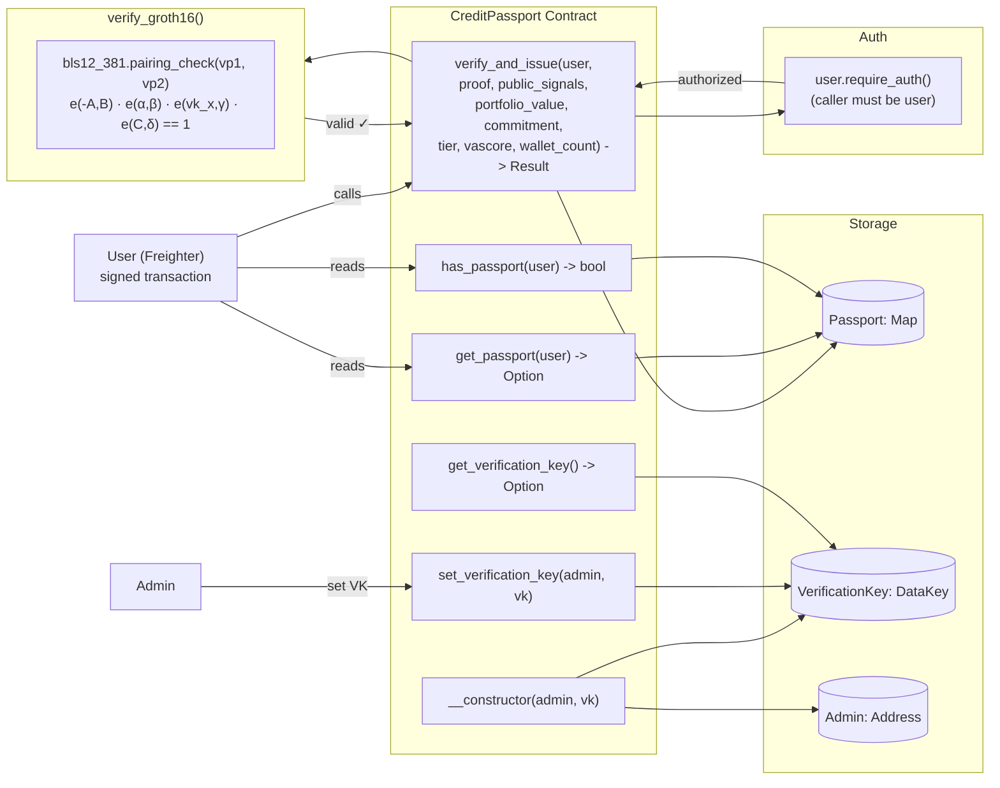
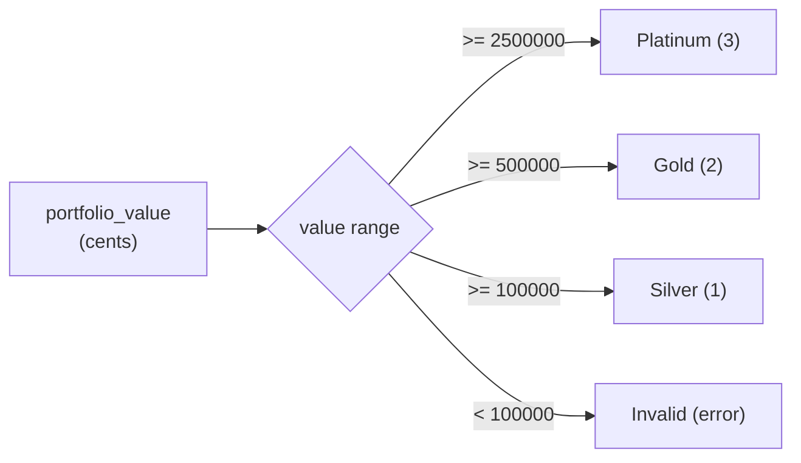
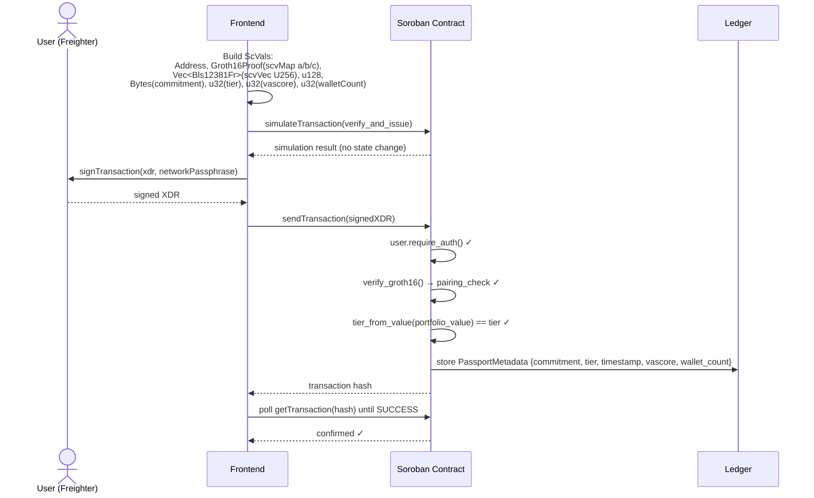

# Credit Passport — Soroban Contract

On-chain passport registry with real **Groth16 ZK proof verification** on **BLS12-381** using Stellar's native pairing host functions (CAP-0059). Issued passports store a commitment hash, tier, timestamp, VAScore, and wallet count on-chain, linked to the user's Stellar address.

## Contract Architecture



## Types

### `VerificationKey`

```rust
pub struct VerificationKey {
    alpha: Bls12381G1Affine,   // 96 bytes
    beta:  Bls12381G2Affine,   // 192 bytes
    gamma: Bls12381G2Affine,   // 192 bytes
    delta: Bls12381G2Affine,   // 192 bytes
    ic:    Vec<Bls12381G1Affine>, // one per public signal + 1 for constant
}
```

Generated by the prover binary's `setup` command, serialized as JSON (`vk.json`). `ic.len` = 3 for our circuit (constant + 2 public signals).

### `Groth16Proof`

```rust
pub struct Groth16Proof {
    a: Bls12381G1Affine,   // 96 bytes uncompressed
    b: Bls12381G2Affine,   // 192 bytes
    c: Bls12381G1Affine,   // 96 bytes
}
```

Total proof size: **384 bytes** uncompressed.

### `PassportMetadata`

```rust
pub struct PassportMetadata {
    commitment:  BytesN<32>,  // SHA-256(portfolioValue, nonce) — links ZK proof
    tier:        u32,         // 1=Silver, 2=Gold, 3=Platinum
    verified_at: u64,         // Ledger timestamp when issued
    vascore:     u32,         // Frozen VAScore (0-100)
    wallet_count: u32,        // Number of linked wallets at issuance
}
```

## Functions

### `__constructor(env, admin: Address, vk: VerificationKey)`

Initializes the contract with an admin address and the Groth16 verification key. Called once during deployment.

### `verify_and_issue(env, user: Address, proof: Groth16Proof, public_signals: Vec<Bls12381Fr>, portfolio_value: u128, commitment: BytesN<32>, tier: u32, vascore: u32, wallet_count: u32) -> Result<PassportMetadata, Error>`

Main entry point for passport issuance.

1. **Authorization**: `user.require_auth()` — the Stellar account `user` must have signed the transaction
2. **ZK proof verification**: Calls `verify_groth16(&env, &vk, &proof, &public_signals)` — if invalid, returns `Err(Error::InvalidProof)`
3. **Tier validation**: Maps `portfolio_value` (cents) to tier via `tier_from_value()`. Returns `Err(Error::InvalidTier)` if below Silver (100000¢). Returns `Err(Error::VerificationFailed)` if computed tier doesn't match claimed `tier`
4. **Storage**: Writes `PassportMetadata { commitment, tier, verified_at, vascore, wallet_count }` to `DataKey::Passport(user)`

### `get_passport(env, user: Address) -> Option<PassportMetadata>`

Reads passport metadata for a Stellar address. Returns `Some(PassportMetadata)` or `None`.

### `has_passport(env, user: Address) -> bool`

Returns `true` if `DataKey::Passport(user)` exists.

### `set_verification_key(env, admin: Address, vk: VerificationKey)`

Admin-only (requires `admin.require_auth()`). Updates the stored verification key. Useful for rotating keys or re-deploying with a new circuit.

### `get_verification_key(env) -> Option<VerificationKey>`

Reads the stored verification key. Returns `None` if not initialized.

## On-Chain Groth16 Verification

The `verify_groth16` function at `lib.rs:150-175` implements the full Groth16 verification equation using Stellar's **CAP-0059** BLS12-381 host functions:

```
(1) Reconstruct vk_x:
    vk_x = vk.ic[0]                           // G1Affine
    for i in 0..public_signals.len():
        vk_x += g1_mul(vk.ic[i+1], signal[i])

(2) Pairing check:
    vp1 = [-proof.a, vk.alpha, vk_x, proof.c]   // Vec<G1Affine>
    vp2 = [proof.b, vk.beta, vk.gamma, vk.delta] // Vec<G2Affine>
    result = pairing_check(vp1, vp2)             // true if product == 1
```

Key details:
- **`-proof.a`**: Implemented via `Neg` trait on `&Bls12381G1Affine` — wraps `from_bytes` on negated coordinates
- **`g1_mul`**: Host function for G1 scalar multiplication
- **`g1_add`**: Host function for G1 addition
- **`pairing_check`**: Single host call computing `e(-A,B) · e(α,β) · e(vk_x,γ) · e(C,δ)` → returns `bool`
- Resource cost: ~41M CPU / ~297KB memory (well within 100M / 40MB limits)

## Tier Mapping



| Tier | Dollar Threshold | Cents Threshold (contract) |
|------|-----------------|---------------------------|
| 1 — Silver | ≥ $1,000 | 100000 |
| 2 — Gold | ≥ $5,000 | 500000 |
| 3 — Platinum | ≥ $25,000 | 2500000 |

## Errors

| Code | Name | Description |
|------|------|-------------|
| 1 | AlreadyIssued | User already has a passport |
| 2 | NotAuthorized | `user.require_auth()` failed |
| 3 | VerificationFailed | Computed tier from `tier_from_value()` doesn't match claimed tier |
| 4 | InvalidTier | `portfolio_value` below Silver threshold (< 100000 cents) |
| 5 | **InvalidProof** | `verify_groth16()` returned false — ZK proof rejected |

## Verification Flow



## Build & Deploy

```bash
# Build WASM
cargo build --release --target wasm32v1-none

# Deploy to testnet (constructor takes admin address + VK)
stellar contract deploy \
  --network testnet \
  --source <funded-key> \
  --wasm target/wasm32v1-none/release/credit_passport.wasm \
  -- --admin <address> --vk <vk-json-string>

# The VK must match what credence-prover setup generates.
# Alternative: deploy with dummy VK, then call set_verification_key.

# Invoke verify_and_issue
stellar contract invoke \
  --network testnet \
  --source <user-key> \
  --id <contract-id> \
  -- \
  verify_and_issue \
  --user <address> \
  --proof '{"a":"<hex96>","b":"<hex192>","c":"<hex96>"}' \
  --public_signals '["<hex32>","<hex32>"]' \
  --portfolio_value 770000 \
  --commitment <hex64> \
  --tier 3 \
  --vascore 75 \
  --wallet_count 3
```

## Testing

```bash
cargo test
```

Six test cases:

| Test | What it verifies |
|------|-----------------|
| `test_constructor_sets_vk` | Constructor stores VK, `get_verification_key` returns it |
| `test_issue_and_retrieve` | Issues a passport, verifies all fields (tier, commitment, vascore, wallet_count) |
| `test_tier_validation` | Portfolio below Silver → `InvalidTier`; tier mismatch → `VerificationFailed` |
| `test_set_verification_key` | Admin can update VK, value persists |
| `test_vascore_and_wallet_count_in_passport` | Null passport returns None; has_passport false for unissued user |
| `test_already_issued` | (snapshot) Double issuance returns AlreadyIssued |

## Deployed Contract

| Network | Contract ID |
|---------|-------------|
| Stellar Testnet | `CBRFQ6BBNJNC6HF33MG6KT5AFWXQ6EPICZOMIPQR7EAQGESNKNRHC37X` |

[Explorer Link](https://stellar.expert/explorer/testnet/contract/CBRFQ6BBNJNC6HF33MG6KT5AFWXQ6EPICZOMIPQR7EAQGESNKNRHC37X)

## Dependencies

- `soroban-sdk = "27.0.0-rc.1"` — Soroban Environment v27 with `require_auth()`, persistent storage, BLS12-381 host functions
- Rust target: `wasm32v1-none` (requires Rust 1.84+)
- No external cryptographic dependencies — all BLS12-381 operations use Stellar host functions (CAP-0059)
