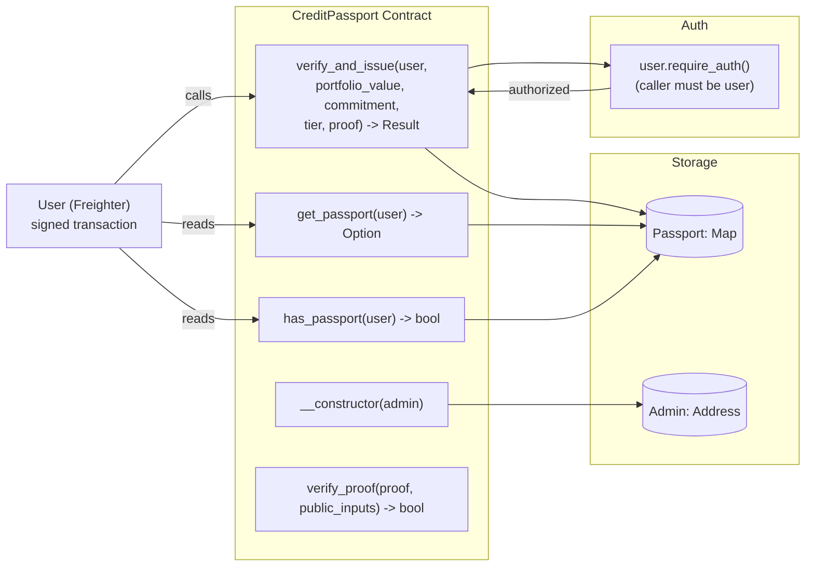
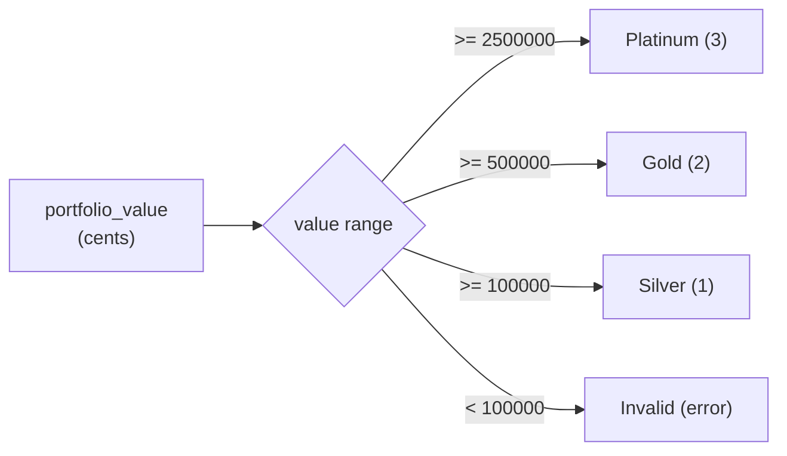
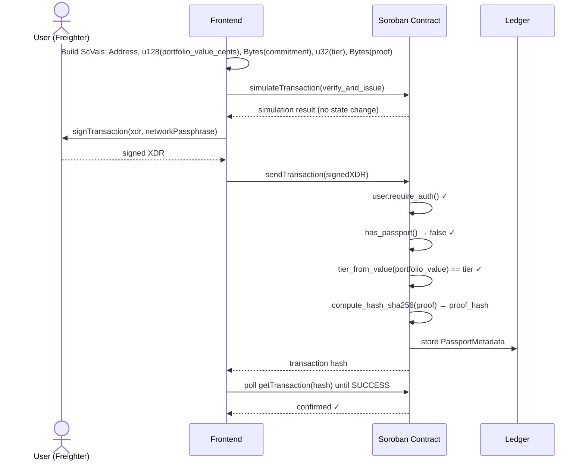

# Credit Passport — Soroban Contract

On-chain passport registry with ZK proof verification for Stellar. Issued passports store a commitment hash, tier, timestamp, and proof hash on-chain, linked to the user's Stellar address.

## Contract Architecture



## Functions

### `__constructor(env, admin)`

Initializes the contract with an admin address stored as `DataKey::Admin`. Called once during deployment.

### `verify_and_issue(env, user, portfolio_value, commitment, tier, proof) -> Result<PassportMetadata, Error>`

The main entry point for passport issuance.

1. **Authorization**: Calls `user.require_auth()` — the Stellar account `user` must have signed the transaction
2. **Double-issue check**: If `has_passport(user)` is true, returns `Err(Error::AlreadyIssued)`
3. **Tier validation**: Maps `portfolio_value` (in cents) to a tier via `tier_from_value()`. Returns `Err(Error::InvalidTier)` if portfolio is below Silver (100000¢). Returns `Err(Error::VerificationFailed)` if the computed tier doesn't match the claimed `tier`.
4. **Proof hash**: Computes SHA-256 of the proof bytes via `env.compute_hash_sha256(proof)`. This is a placeholder — the real UltraHonk verifier is deferred (the crate `ultrahonk_rust_verifier` is not yet available on crates.io).
5. **Storage**: Writes `PassportMetadata { commitment, tier, verified_at: env.ledger().timestamp(), proof_hash }` to `DataKey::Passport(user)`.

### `get_passport(env, user) -> Option<PassportMetadata>`

Reads the passport metadata for a given Stellar address. Returns `Some(PassportMetadata)` or `None` if not issued.

```rust
pub struct PassportMetadata {
    commitment: BytesN<32>,    // SHA-256(portfolioValue, nonce) — links the ZK proof
    tier: u32,                 // 1=Silver, 2=Gold, 3=Platinum
    verified_at: u64,          // Ledger timestamp when the passport was issued
    proof_hash: BytesN<32>,    // SHA-256(proof_bytes) — proof fingerprint
}
```

### `has_passport(env, user) -> bool`

Boolean check — returns `true` if `DataKey::Passport(user)` exists in storage.

### `verify_proof(env, proof, public_inputs) -> bool`

Placeholder verification function. Computes SHA-256 of the concatenated inputs and returns `true` if the hash is non-zero. Intended to be replaced with real UltraHonk verification when the verifier crate becomes available.

## Tier Mapping



| Tier | Dollar Threshold | Cents Threshold (contract) |
|------|-----------------|---------------------------|
| 1 — Silver | ≥ $1,000 | 100000 |
| 2 — Gold | ≥ $5,000 | 500000 |
| 3 — Platinum | ≥ $25,000 | 2500000 |

The frontend multiplies the dollar portfolio value by 100 before passing it to `verify_and_issue` (ScVal u128). The contract thresholds are in the same cents unit.

## Errors

| Code | Name | Description |
|------|------|-------------|
| 1 | AlreadyIssued | User already has a passport — `has_passport()` returned true |
| 2 | NotAuthorized | `user.require_auth()` failed — caller is not the user address |
| 3 | VerificationFailed | The computed tier from `tier_from_value()` doesn't match the claimed tier |
| 4 | InvalidTier | `portfolio_value` is below the Silver threshold (less than 100000 cents) |

## Verification Flow



## Build & Deploy

```bash
# Build WASM
cargo build --release --target wasm32v1-none

# Deploy to testnet
stellar contract deploy \
  --network testnet \
  --source <funded-key> \
  --wasm target/wasm32v1-none/release/credit_passport.wasm \
  -- --admin <address>

# Invoke (example)
stellar contract invoke \
  --network testnet \
  --source <user-key> \
  --id <contract-id> \
  -- \
  verify_and_issue \
  --user <address> \
  --portfolio_value 770000 \
  --commitment <hex> \
  --tier 3 \
  --proof <hex>
```

## Testing

```bash
cargo test
```

Three test cases:

| Test | What it verifies |
|------|-----------------|
| `test_issue_and_retrieve` | Issues a passport, calls `get_passport` to verify all fields match, confirms `has_passport` returns true |
| `test_cannot_double_issue` | Issues a passport for a user, attempts to issue again — expects `AlreadyIssued` error |
| `test_tier_from_value` | Tests the `tier_from_value` helper with values at each boundary (Silver, Gold, Platinum, below Silver) |

## Deployed Contract

| Network | Contract ID |
|---------|-------------|
| Stellar Testnet | `CBIYSGXEVABVVUGPSXIZOGFSVLAVDB6S6PDLW6RSK35BHECQGXKLCD42` |

[Explorer Link](https://stellar.expert/explorer/testnet/contract/CBIYSGXEVABVVUGPSXIZOGFSVLAVDB6S6PDLW6RSK35BHECQGXKLCD42)

## Dependencies

- `soroban-sdk = "27.0.0-rc.1"` — Soroban Environment v27 with `require_auth()`, `compute_hash_sha256()`, persistent storage
- Rust target: `wasm32v1-none` (requires Rust 1.84+)
- No external dependencies for cryptographic primitives — SHA-256 is a host function provided by the Soroban environment
