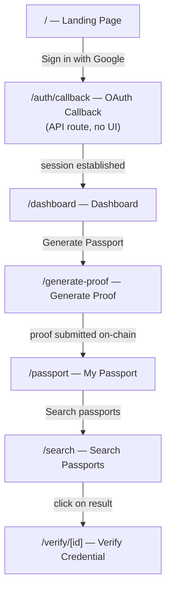
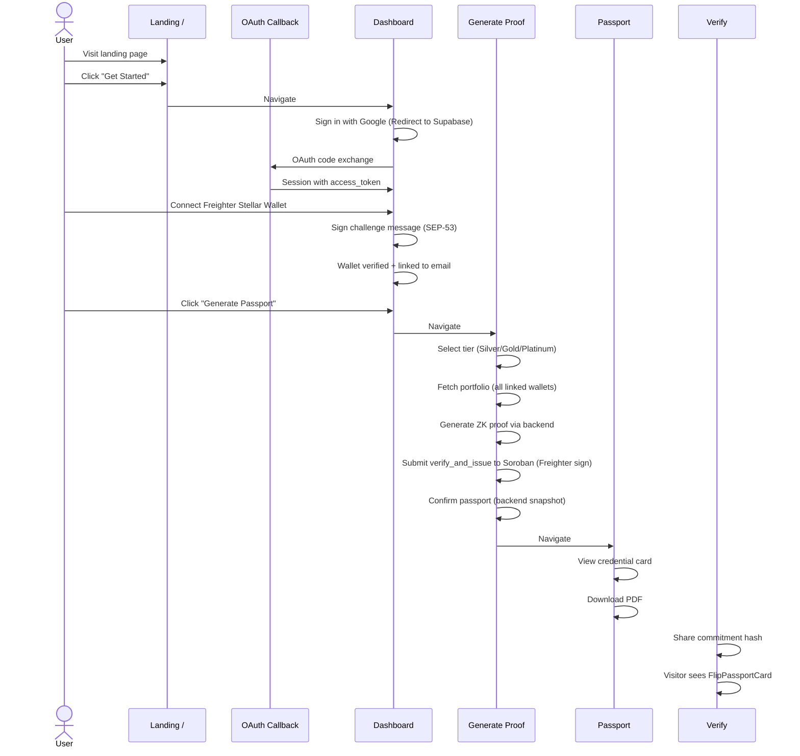

# Frontend — Crypto Credit Passport dApp (Next.js 16)

Next.js dApp with Supabase Google Auth, Freighter Stellar wallet, ZK proof generation UI, Soroban contract submission, interactive passport card with 3D flip, and PDF export.

## Route Map



## Full User Flow



## Pages

### `/` — Landing Page

Layout: AmbientBackground gradient orbs → hero section with sample passport card → problem/solution narrative → how-it-works 4-step flow → lender view comparison → CTA to dashboard.

Key components: `HeroPassportCard` (Gold-tier `FlipPassportCard` with demo data), `ComparisonIllustration`, `LenderViewComparison`, `AmbientBackground`.

### `/dashboard` — Dashboard

The main authenticated hub. Shows:
- **Passport status**: tier, combined VAScore (A–F badge), wallet count, commit hash — fetched via `getMyPassport(token)`
- **Wallet table**: linked wallets with address, status, portfolio value per wallet, tier (Bronze/Silver/Gold/Platinum from individual portfolio), score (A–F per wallet)
- **Wallet linking**: input Stellar address → backend check → sign challenge via Freighter → verify → wallet added to table
- **"Generate Passport"** CTA when no passport exists, "View Passport" when one exists

Key components: `WalletManager`, `GoogleSignInButton`, `StellarWalletButton`, `ThemeToggle`.

### `/generate-proof` — Proof Generation

Three-step process UI with animated progress indicators:

1. **Portfolio fetch**: On mount, aggregates all linked wallets' portfolios via backend, shows total
2. **Tier selection**: Three cards (Silver $1K / Gold $5K / Platinum $25K) — insufficient portfolio shows "Insufficient" label and disables the card
3. **Proof generation**: Calls backend `preparePassport` → receives ZK proof → builds ScVals (Address, u128 cents, Bytes commitment, u32 tier, Bytes proof) → simulates Stellar transaction → signs with Freighter → submits to Soroban → polls until confirmed → calls `confirmPassport` backend endpoint to freeze snapshot

On Stellar submission failure: preserves computed proof (no re-generation), offers "Retry Submission" button.

### `/passport` — My Passport

Displays the `PassportCard` component (desktop: horizontal layout with seal + QR code on left, details on right; mobile: vertical stacked layout). Fetches data from `getMyPassport(token)` which returns the frozen `IssuedPassport` snapshot.

Features:
- **QR Code**: scannable link to `/verify/[commitmentHash]`
- **PDF Export**: captures the card DOM via `html-to-image` → embeds in A4 landscape PDF via `jsPDF` → auto-downloads

### `/search` — Public Passport Search

Search input (text field + "Search" button, Enter key support). Calls `GET /api/passport/search?q=` with the query. Results displayed using `FlipPassportCard`. Four states: initial ("Enter email or hash") → loading (spinner) → found (card with 3D flip) → not found (error message).

### `/verify/[id]` — Public Verification

Reads `commitmentHash` from the URL path. Calls `GET /api/passport/verify/:commitmentHash`. Displays the result using `FlipPassportCard` with all passport metadata (tier, score, wallet count, holder email, proof hash, issued date). Three states: loading → found (flip card) → not found.

### `/auth/callback` — Supabase OAuth Handler

API route (no UI). Receives the OAuth code from Google, exchanges it for a session via Supabase SSR, redirects to `/dashboard`.

## Component Tree

```
RootLayout (app/layout.tsx)
├── ThemeProvider (lib/theme-context.tsx)
│   └── localStorage persistence for light/dark mode
├── StellarWalletProvider (lib/stellar-wallet-context.tsx)
│   └── Freighter wallet state + connect/disconnect/signMessage/signTransaction
└── pages
    ├── Landing (/)
    │   ├── AmbientBackground (animated gradient orbs)
    │   ├── Header
    │   │   ├── Image (Credence.png logo)
    │   │   ├── StellarWalletButton
    │   │   └── ThemeToggle
    │   ├── HeroPassportCard (FlipPassportCard with demo props)
    │   ├── ComparisonIllustration
    │   └── LenderViewComparison
    │
    ├── Dashboard (/dashboard)
    │   ├── AmbientBackground
    │   ├── Header
    │   ├── WalletManager
    │   │   └── Table of linked wallets
    │   │       ├── Address column
    │   │       ├── Tier column (Bronze/Silver/Gold/Platinum)
    │   │       ├── Score column (A-F color-coded)
    │   │       ├── Status column
    │   │       └── Action column (remove)
    │   ├── StellarWalletButton (for wallet verification flow)
    │   ├── GoogleSignInButton
    │   └── PassportCard (if passport exists)
    │
    ├── Generate Proof (/generate-proof)
    │   ├── AmbientBackground
    │   ├── Header
    │   ├── Tier selection buttons (Silver/Gold/Platinum)
    │   ├── Step progress indicator (4 steps)
    │   ├── Commit hash display on success
    │   └── Navigation (View Passport / New Proof)
    │
    ├── Passport (/passport)
    │   ├── Header
    │   ├── PassportCard (passport-card.tsx)
    │   │   ├── PassportSeal (SVG shield)
    │   │   ├── QRDisplay (qrcode library)
    │   │   ├── Tier badge
    │   │   ├── Score badge
    │   │   ├── Wallet count
    │   │   ├── Commitment hash
    │   │   └── User email
    │   └── Download PDF button
    │
    ├── Search (/search)
    │   ├── Header
    │   ├── Search input + button
    │   └── FlipPassportCard (result)
    │
    └── Verify (/verify/[id])
        ├── Header
        ├── FlipPassportCard (result)
        └── Footer
```

## Component Reference

| Component | File | Purpose |
|-----------|------|---------|
| **FlipPassportCard** | `components/FlipPassportCard.tsx` | Reusable 3D-tilt flip card. Front: seal + title + tier badge + checkmarks. Back: all credential details. Used by HeroPassportCard, verify page, search page. |
| **HeroPassportCard** | `components/HeroPassportCard.tsx` | Demo Gold-tier FlipPassportCard with hardcoded data for the landing page hero section. |
| **passport-card** | `components/passport-card.tsx` | Full passport credential card with desktop horizontal layout (seal + QR left, details right) and mobile vertical layout. Used on /passport and /dashboard. |
| **InteractivePassportCard** | `components/InteractivePassportCard.tsx` | Legacy tilt-card (less used, maintained for compatibility). |
| **PassportSeal** | `components/PassportSeal.tsx` | SVG "ZK VERIFIED" seal with circular shield design, gradient background. |
| **QRDisplay** | `components/QRDisplay.tsx` | Generates QR code from a URL string using the `qrcode` library. |
| **WalletManager** | `components/WalletManager.tsx` | Full wallet management UI: table of linked wallets with tier/score columns, wallet verification flow (check → sign → verify), error state with retry. |
| **StellarWalletButton** | `components/StellarWalletButton.tsx` | Freighter connect/disconnect button. Displays truncated G-address when connected. |
| **GoogleSignInButton** | `components/GoogleSignInButton.tsx` | Supabase Google OAuth button. Shows user avatar + email when signed in, "Sign in with Google" when signed out. |
| **Header** | `components/Header.tsx` | Sticky top header with Credence logo, StellarWalletButton, GoogleSignInButton, ThemeToggle. Used on all pages. |
| **AmbientBackground** | `components/AmbientBackground.tsx` | Three blurred gradient orbs at 15–30% opacity, 60px blur, 30–40s CSS drift cycles. Theme-aware via CSS variables. |
| **ThemeToggle** | `components/ThemeToggle.tsx` | Light/dark mode toggle button. |
| **ComparisonIllustration** | `components/ComparisonIllustration.tsx` | Side-by-side visual comparing traditional credit signals vs crypto credit passport signals. |
| **LenderViewComparison** | `components/LenderViewComparison.tsx` | "What lender sees vs what stays private" comparison. |

## Lib Files

| File | What it exports | Purpose |
|------|----------------|---------|
| `lib/api.ts` | 13 async functions | All backend API calls (fetchStellarPortfolio, preparePassport, confirmPassport, getMyPassport, searchPassport, verifyPassport, getPassport, getChallenge, checkWallet, verifyWallet, listWallets, fetchVAScore). BASE_URL from `NEXT_PUBLIC_API_URL`. |
| `lib/stellar-wallet-context.tsx` | StellarWalletProvider + useStellarWallet hook | React context wrapping Freighter `@stellar/freighter-api`. State: address, connected, isLoading. Methods: connect(), disconnect(), signMessage(), signTransaction(xdr, networkPassphrase). |
| `lib/theme-context.tsx` | ThemeProvider + useTheme hook | Light/dark mode state with `localStorage` persistence. Toggles `data-theme` attribute on `<html>`. |
| `lib/use-auth.ts` | useAuth hook | Supabase auth: lazy `getSupabaseClient()` for session, `user`, `session` state via `onAuthStateChange`, `signIn()` (Google OAuth), `signOut()`. |
| `lib/supabase/client.ts` | getSupabaseClient() | Singleton browser Supabase client (lazy — allows placeholder env vars during build). |
| `lib/supabase/server.ts` | createServerSupabaseClient() | SSR Supabase client for middleware (reads cookies directly). |

## Wallet Integration

**Stellar-only** — EVM wallets (RainbowKit, Wagmi, viem) have been removed. The only wallet integration is Freighter for the Stellar network.

Flow:
1. User signs in with **Google** (Supabase Auth) → JWT session
2. User connects **Freighter** Stellar wallet → G-address
3. Backend creates a signing challenge (SEP-53 compatible)
4. User signs with Freighter `signMessage()`
5. Backend verifies the signature → creates `WalletLink` record binding the Stellar address to the Google email
6. Passport lookup and proof generation use **email** (not wallet address) — all linked wallets contribute

## Styling

- **Framework**: Tailwind CSS v4 with `@import "tailwindcss"` in `globals.css`
- **Typography**: Manrope (headings, weights 500/600/700) via `@fontsource/manrope` + Inter (body, system default)
- **Color system** (CSS variables, light + dark themes):

| Token | Dark | Light | Usage |
|-------|------|-------|-------|
| `--bg-primary` | `#061327` | `#F5F2ED` | Page background |
| `--bg-surface` | `#0B1A33` | `#EBE6DE` | Card/panel surfaces |
| `--bg-elevated` | `#112244` | `#E0D9CE` | Elevated surfaces |
| `--accent` | `#5271FF` | `#5271FF` | Interactive elements (buttons, links) |
| `--success` | `#1ED760` | `#1ED760` | Verified/positive indicators |
| `--gold` | `#F5B400` | `#F5B400` | Gold tier + warnings |
| `--text-primary` | `#FFFFFF` | `#1A1A2E` | Primary text |
| `--text-secondary` | `#8892B0` | `#6B7280` | Secondary text |

- **Custom classes** (in `globals.css`): `.passport-card`, `.verified-seal`, `.unverified-seal`, `.verification-stamp`
- **Ambient background**: CSS-only animated gradient orbs, no JS animation libraries
- **Theme toggle**: Switches `data-theme` attribute on `<html>`, all colors via CSS variable overrides

## Setup

```bash
npm install
cp .env.local.example .env.local   # edit with your Supabase + Contract ID values
npm run dev                        # → http://localhost:3000
npm run build                      # production build
npm run start                      # production server
```

## Dependencies

| Package | Version | Purpose |
|---------|---------|---------|
| next | 16.2.9 | Framework (App Router) |
| react / react-dom | 19.2.4 | UI library |
| @stellar/freighter-api | 6.0.1 | Freighter wallet integration |
| @stellar/stellar-sdk | 16.0.1 | ScVal construction, transaction building, Soroban submission |
| @supabase/ssr | 0.12.0 | Supabase SSR for middleware + OAuth callback |
| @supabase/supabase-js | 2.108.2 | Supabase client (lazy singleton) |
| @fontsource/manrope | 5.2.8 | Manrope font for headings |
| html-to-image | 1.11.13 | Capture DOM to PNG for PDF export |
| jspdf | 4.2.1 | Generate PDF from captured image |
| lucide-react | 1.21.0 | Icon library (Check, etc.) |
| qrcode | 1.5.4 | QR code generation for the passport card |
| tailwindcss | 4.x | Utility-first CSS framework |
| typescript | 5.x | Type checking |
